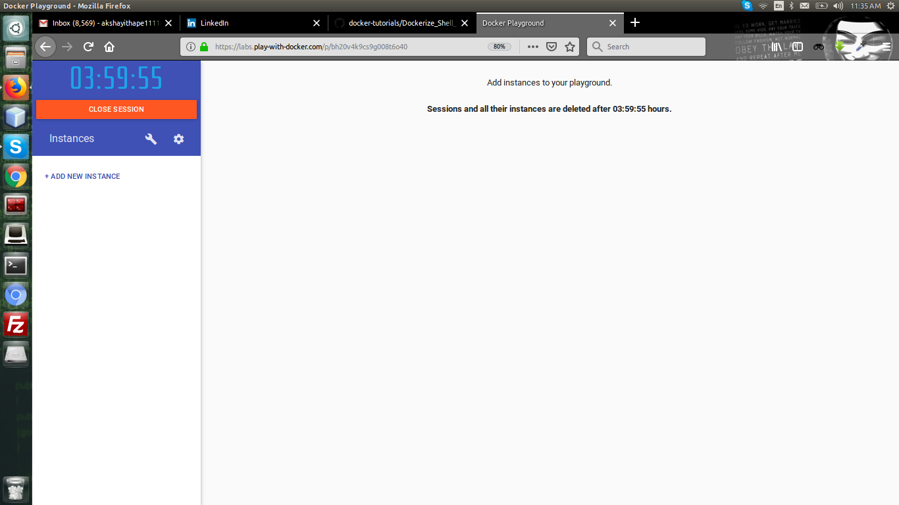
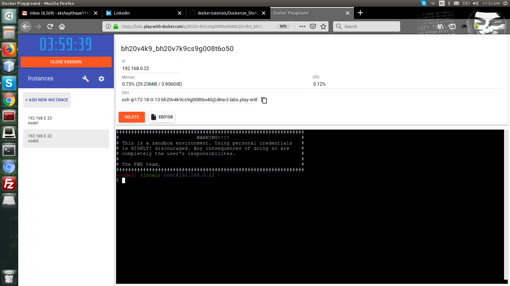
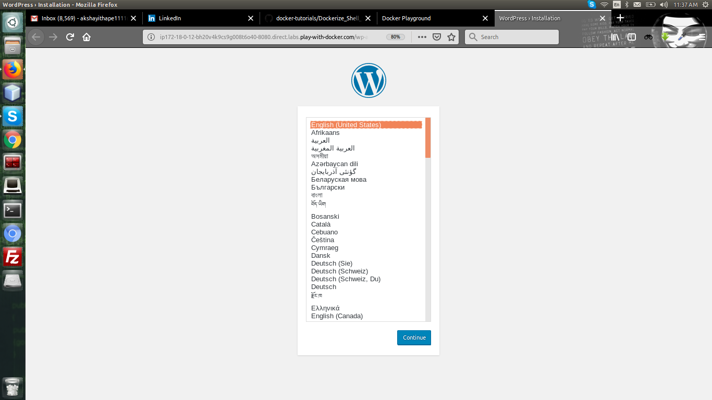
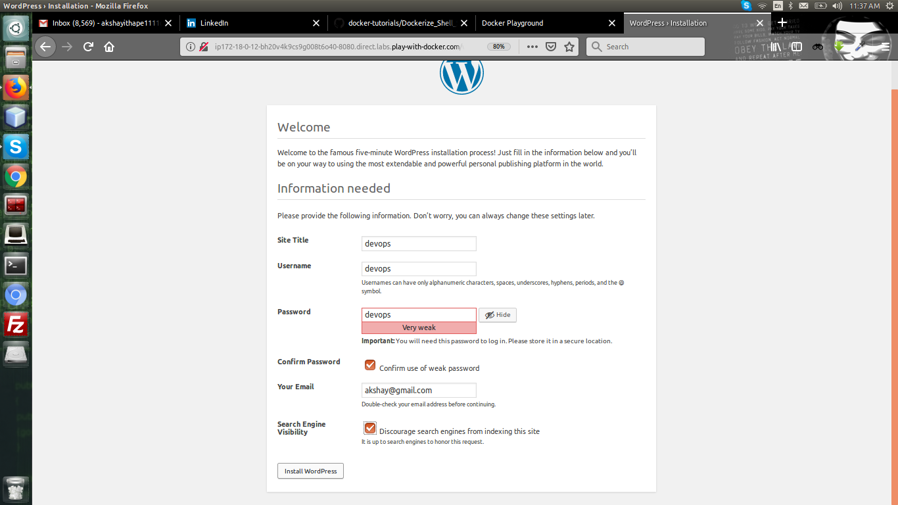
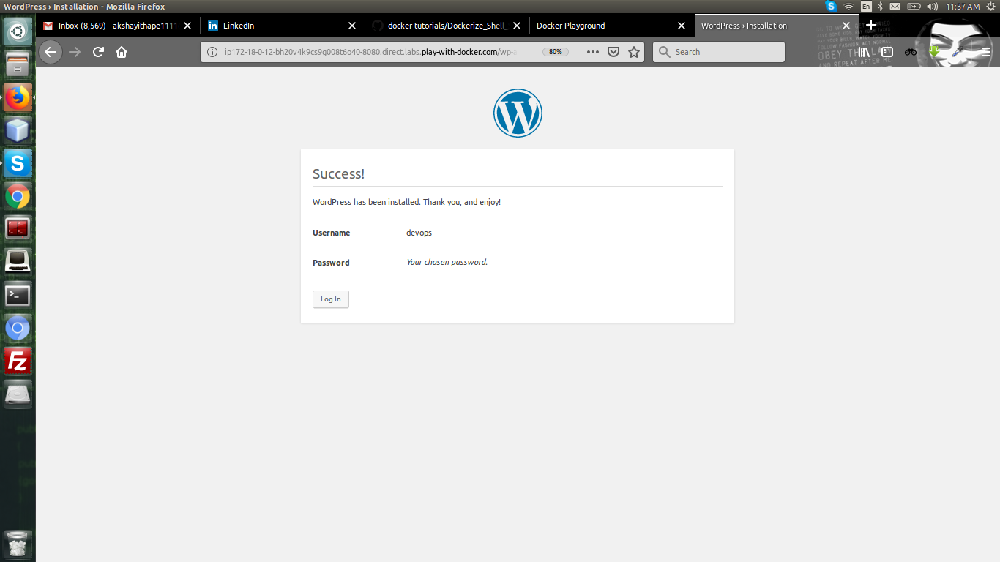
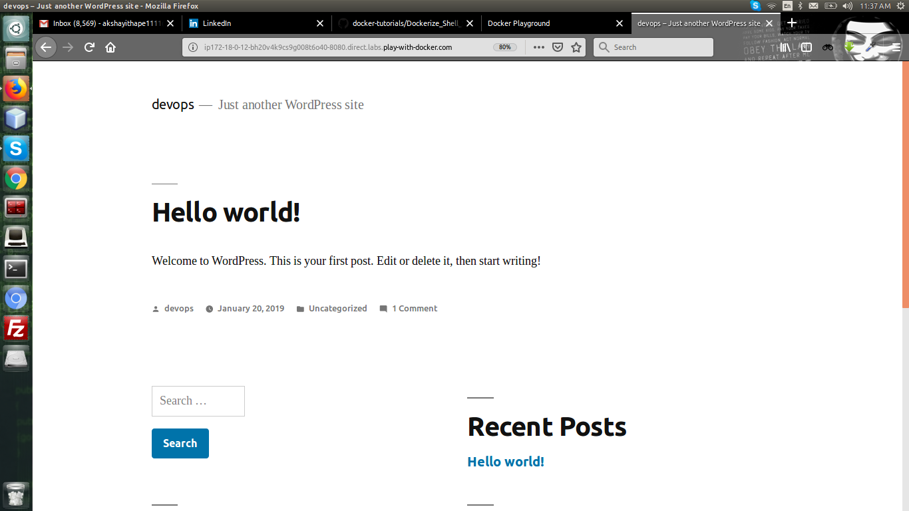
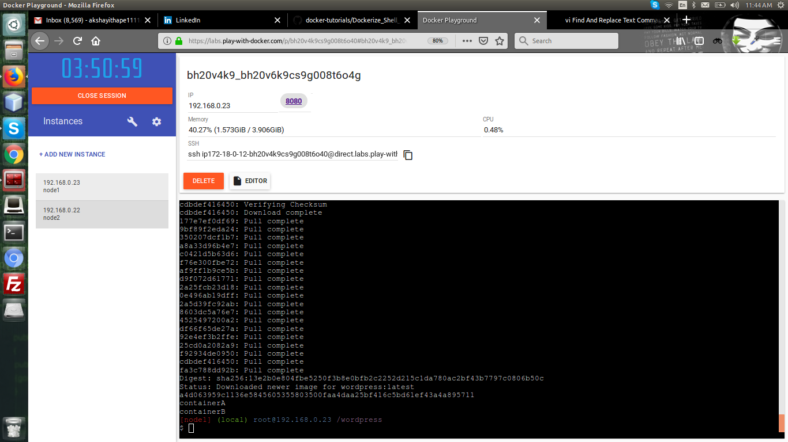
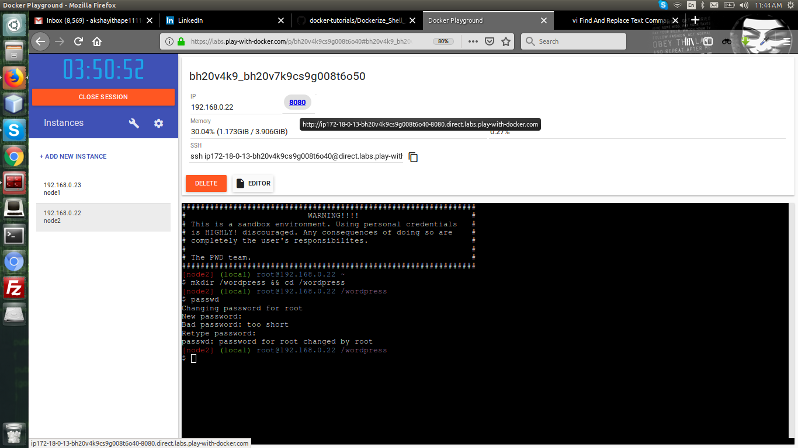
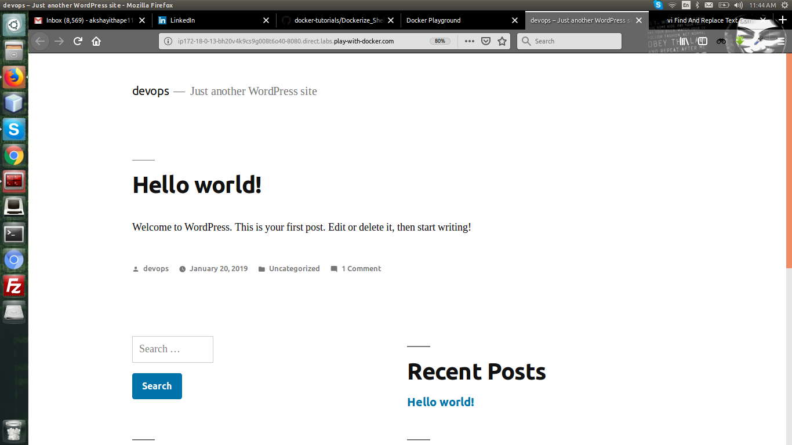

# Dockerize Shell Script Lab 2
In this lab session we are going to do continuous deployment using shell script for that we build one image using dockerfile and launch the container with that image .<br/>
**NOTE :- Practice this lab session only with play with docker because the commands may be change as per your environment**

### Prerequisite
1. Basic understanding the linux environment
2. Basic knowledge of the wordpress 
### Our environment
Before we start you should understand the our environment for this lab session . <br/>
- node 1 (development server) :-
	- containerA - database server (mariadb image)
	- containerB - web server (wordpress image)
	- containerC - Automation server (This container launch with our image which we will build with dockerfile)
- node 2 (production server) :-
	- containerA - database server (mariadb image)
	- containerB - web server (wordpress image)
### Creating two node with play with docker
1. Open **play with docker** 

2. Click on **+ADD NEW INSTANCE**i

3. Node one is created 
4. Click on one more time **+ADD NEW INSTANCE**
5. Node two is created 
6. Now you know the **IP** of both node
 
7. Go to the node two and execute the **passwd** command to change the password of root user and change password to **123** .

### Step 1 - Create new directory **wordpress** at our both node system 
Start off by making a new directory where you wish to store the files for WordPress and MariaDB for example in your home directory.
```
mkdir /wordpress && cd /wordpress
```

### Step 2 - Launch the container for database server (mariadb image) on node 1
In this step we are going to launch the database container using mariadb image <br/>

Search Mariadb image
```
docker search mariadb
```

Pull mariadb docker image
```
docker pull mariadb
```

Run database container 
* run -- use for run the container
* -e -- for the env variable like in below command we use MYSQL_ROOT_PASSWORD env variable to assign password
* –name wordpress -- Gives the container a name.
* -v “/wordpress/database”:/var/lib/mysql -- Creates a data directory linked to the container storage to ensure data persistence.
* -d -- Tells Docker to run the container in daemon.
* mariadb:latest -- name of image
```
docker run -e MYSQL_ROOT_PASSWORD=root123 -e MYSQL_DATABASE=wordpress --name wordpressdb -v "/wordpress/database":/var/lib/mysql -d mariadb:latest
```

List running docker processes 
```
docker ps
```

### Step 3 - Launch the container for web server (wordpress image) on node 1
In this step we are going to launch the web server container using wordpress image <br/>

Search Wordpress image
```
docker search wordpress
```

Pull wordpress docker image
```
docker pull wordpress
```

Run Wordpress container
* -e -- for the env variable like in below command we use WORDPRESS_DB_PASSWORD env variable to assign password
* –name wordpress -- Gives the container a name.
* –link wordpressdb:mysql -- Links the WordPress container with the MariaDB container so that the applications can interact.
* -p 8080:80 -- Tells Docker to pass connections from your server’s HTTP port to the containers internal port 80.
* -v “/wordpress/html”:/var/www/html -- Sets the WordPress files accessible from outside the container. The volume files will remain even if the container was removed.
* -d -- Makes the container run on background
* wordpress -- name of image
```
docker run -e WORDPRESS_DB_PASSWORD=root123 --name wordpress --link wordpressdb:mysql -p 8080:80 -v "/wordpress/html":/var/www/html -d wordpress
```

List running docker processes
```
docker ps
```

### Step 4 :- Setup wordpress 
In **play with docker** on up side open port are show in blue color click on that and setup wordpress . 





### Step 5 :- Write the shell script for continuous deployment
In the step we are going to write shell script for continuous deployment <br/>
create file **deploy.sh** and copy below code in it and save it .
```
#!/bin/bash
sshpass -p"123" ssh -o "StrictHostKeyChecking no" root@192.168.0.21 'if [ ! "$(/usr/local/bin/docker ps -q -f name=containerA)" ]; then
    if [ "$(/usr/local/bin/docker ps -aq -f status=exited -f name=containerA)" ]; then
        # cleanup
        /usr/local/bin/docker rm containerA
    fi
    # run your container
    /usr/local/bin/docker run -e MYSQL_ROOT_PASSWORD=root123 -e MYSQL_DATABASE=wordpress --name containerA -v "/wordpress/database":/var/lib/mysql -d mariadb:latest
fi
if [ ! "$(/usr/local/bin/docker ps -q -f name=containerB)" ]; then
    if [ "$(/usr/local/bin/docker ps -aq -f status=exited -f name=containerB)" ]; then
        # cleanup
        /usr/local/bin/docker rm containerB
    fi
    # run your container
    /usr/local/bin/docker run -e WORDPRESS_DB_PASSWORD=root123 --name containerB --link containerA:mysql -p 8080:80 -v "/wordpress/html":/var/www/html -d wordpress
fi
'
sshpass -p"123" scp -o "StrictHostKeyChecking no" -r /wordpress/. root@192.168.0.21:/wordpress
sshpass -p"123" ssh -o "StrictHostKeyChecking no" root@192.168.0.21 '/usr/local/bin/docker restart containerA && sleep 20 && /usr/local/bin/docker restart containerB'
```
In above shell script we are going to use following commands
1. sshpass - sshpass command is used to pass the password to ssh command 
2. ssh - ssh is used to take the secure access of remote system 
3. scp - scp is used to copy securly .
4. sleep - sleep is command used for put our program in sleep mode .

### Step 6 :- Write the dockerfile 
In this step we are going to write dockerfile file to build our image <br/>
create file **dockerfile** and copy below code in it and save it .
```
ARG CODE_VERSION=latest
FROM ubuntu:${CODE_VERSION}
ADD . /wordpress
COPY ./deploy.sh /
RUN chmod u+x /deploy.sh
RUN apt-get update && apt-get install ssh sshpass -y
ENTRYPOINT ["/deploy.sh"]
```
For more details [Lab Session for Docker File](../docker_deep_dive_part_1/dockerfile_hands_on_session.md)

### Step 7 :- Build the image using our dockerfile
In this step we are going to build the image using dockerfile
```
docker build -f dockerfile -t demo/labtwo:1 . 
```
### Step 8 :- Run the container using our image
In this step we are going to run the container using our image
```
docker run -v /wordpress:/wordpress demo/labtwo:1
``` 
### Step 9 :- Go to the node 2 check it our changes is reflected or not
Go to node 2 in **play with docker** on up side open port are show in blue color click on that and check weather our changes is reflected or not .



